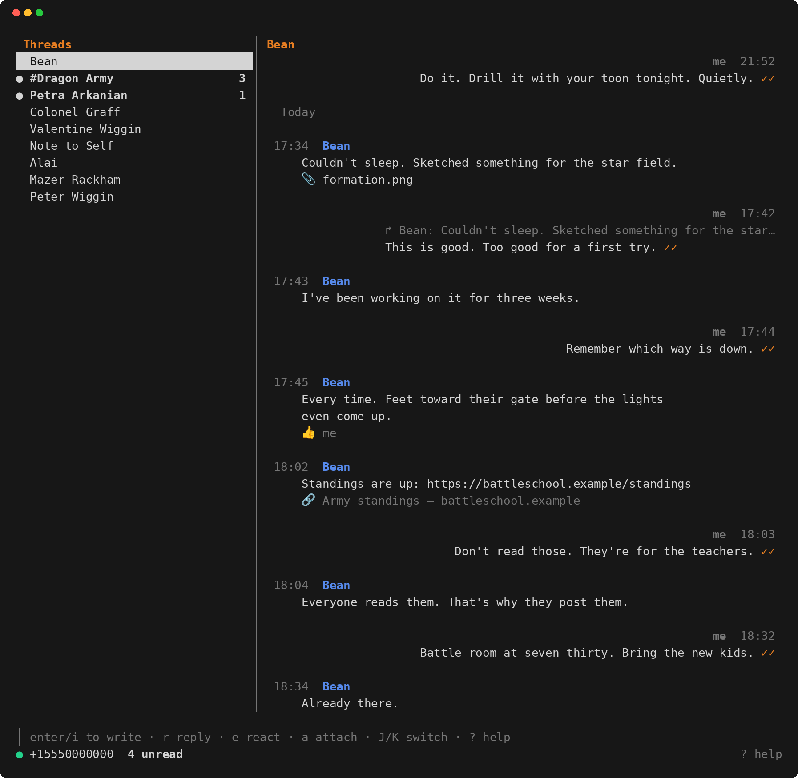

<p align="center">
  <picture>
    <source media="(prefers-color-scheme: dark)" srcset="docs/signal-headless-lockup-dark.svg">
    
  </picture>
</p>

Signal on a computer without Signal Desktop: one small program that links as
a Signal device and keeps receiving in the background. Chat from the
terminal or from VS Code. No Java, no Docker, no signal-cli.

- **A real linked device.** It links like Signal Desktop (scan a QR code),
  and can bring over the phone's message history.
- **Always receiving.** A background service holds the connection and keeps
  every message, whether or not a client is open.
- **A keyboard-driven terminal UI:** conversations on the left, drafts per
  conversation, replies, reactions, attachments, search, link previews,
  emoji shortcodes.
- **A VS Code extension** ([signal-headless-vscode](https://github.com/jaggedmountain/signal-headless-vscode)):
  notifications, a conversations view, chat tabs, search. It also works in
  Remote-SSH windows.
- **Scriptable:** `--send`, `--status`, and a socket API that also stands in
  for `signal-cli jsonRpc`.

*Unofficial. Not affiliated with or endorsed by Signal Messenger or the
Signal Technology Foundation.*

**Contents:** [Install](#install) · [Linking](#linking) ·
[The terminal UI](#the-terminal-ui) · [VS Code](#vs-code) ·
[Command line](#command-line) · [Always on](#always-on) ·
[Troubleshooting](#troubleshooting) · [Security and privacy](#security-and-privacy) ·
[Platforms](#platforms) · [Donate](#donate) · [License](#license)

## Install

Linux and macOS:

```bash
curl -fsSL https://github.com/jaggedmountain/signal-headless/releases/latest/download/install.sh | sh
signal-headless --link      # scan the QR code: phone → Settings → Linked devices → Link new device
signal-headless             # the terminal UI; starts the background service when needed
```

Windows, in PowerShell:

```powershell
irm https://github.com/jaggedmountain/signal-headless/releases/latest/download/install.ps1 | iex
```

The installer downloads the release for this computer, checks it against the
release's checksums, and installs it for this user: `~/.local/bin` on Linux
and macOS, `%LOCALAPPDATA%\Programs\signal-headless` on Windows (added to
the user PATH). No administrator rights needed. On Linux,
`… | sh -s -- --systemd` also sets up an always-on service
([Always on](#always-on)).

- **Update:** `signal-headless --update`. It installs the latest release
  with the same options and restarts the service. Messages, keys and the
  link are kept.
- **Uninstall:** `signal-headless --uninstall`. It unlinks this computer
  from the Signal account and deletes its message history and keys, which
  are stored unencrypted. `--uninstall --retain` keeps them. On Windows it
  prints the command to run.

With the [VS Code extension](https://github.com/jaggedmountain/signal-headless-vscode)
none of this is needed: it uses this install if there is one, else
downloads its own, and links with a QR code panel.

To build from source, see [CONTRIBUTING.md](CONTRIBUTING.md).

## Linking

```bash
signal-headless --link
```

Scan the code on the phone (Signal App → Settings → Linked devices → Link new device).
The phone then offers **Transfer message history**. If chosen, the history
is imported on first start (progress shows in `--status`, the VS Code
status bar and the log). Attachments from
the last 45 days are fetched in the background; older ones are listed with
a note and can be retried. Deleted, expired and view-once content isn't
imported.

**Unlinking:** `signal-headless --unlink` removes this computer from the
account (like Unlink on the phone) and deletes its keys. It asks for the
account number first. Message history is kept, so linking again doesn't
lose it. If the phone already removed the device, `--unlink --force` just
deletes the local keys.

**Coming from signal-cli?** The device signal-cli linked can be taken over,
keeping its slot, with no QR code:

```bash
signal-headless --import-signal-cli --dry-run   # validate; writes nothing
# stop everything that uses signal-cli, then:
signal-headless --import-signal-cli
```

The import only reads signal-cli's files. Afterwards **signal-cli must never
run for that account again**: two programs on one identity break each
other's sessions. signal-headless refuses to start while signal-cli runs.

## The terminal UI

`signal-headless` (or `--shell`): conversations on the left, the open one on
the right, a compose line at the bottom. Drafts, reply targets and
attachments are kept per conversation, so switching mid-sentence is free.

<p align="center"></p>

| Keys | |
|---|---|
| `J` `K`, `ctrl+n` `ctrl+p` | next / previous conversation (also while writing) |
| `n`, `tab` | next conversation with unread messages |
| `C`, `m`, `:to NAME` | new conversation (tab completes contacts and groups) |
| `j` `k`, `g` `G`, `ctrl+u` `ctrl+d` | select messages, oldest / newest, page |
| `enter`, `i` | write here; `enter` sends, `alt+enter` / `ctrl+j` newline |
| `ctrl+e` | edit the draft in `$EDITOR` |
| `a`, `ctrl+t` | attach a file (tab completes paths); `A` clears attachments |
| `x`, `u` | clear the draft (text and reply target); `u` brings it back |
| `ctrl+x` | send without the link preview shown above the compose line |
| `r` | reply to the selected message (quote) |
| `e`, `+` | react — `1`–`6` for 👍 ❤️ 😂 😮 😢 🙏, or any emoji; empty removes |
| `D` | delete the selected own message for everyone |
| `o` | open the selected message's attachments |
| `y` | copy the message text (OSC 52 clipboard) |
| `/` | search this conversation; `/` `enter` again for the next match |
| `:` | commands: `to`, `attach`, `detach`, `clear`, `archive`, `unarchive`, `archived`, `read`, `search`, `react`, `retry`, `open`, `help`, `quit` |
| `?` | help |
| `q` | quit (confirm with `q` or `enter`; `ctrl+c` quits at once) |

`:joy:`-style shortcodes become emoji (😂). A moment after an https link is
typed, the preview that will be sent shows above the compose line. Opening a
conversation marks it read (sending read receipts if the account has them
on). The terminal bell rings for messages in other conversations
(`SIGNAL_HEADLESS_BELL=0` turns it off).

## VS Code

The [VS Code extension](https://github.com/jaggedmountain/signal-headless-vscode)
(`jaggedmountain.signal-headless`) is a full client: notifications that
appear once even with several windows open, an unread count in the status
bar, a conversations view, chat tabs, search, link previews, and linking
from a QR code panel. It runs on the local side of Remote-SSH windows.

## Command line

```
signal-headless                        the terminal UI (same as --shell)
signal-headless --link [--name N]      link this computer (QR code)
signal-headless --unlink [--force]     remove this device from the account (history is kept)
signal-headless --import-signal-cli    take over signal-cli's device [--dry-run] [--account N]
signal-headless --send TO -m TEXT [-a FILE]...
                                       TO: +number, contact or group name, or "self"
signal-headless --watch CHANNEL        print new messages there that didn't come from this computer
                                       [--json] [--once] [--timeout 10m] [--since ID]
signal-headless --status               account, connection, clients, version
signal-headless --check                linked? (exit status 3 if not)
signal-headless --stop                 stop the background service (clients start it again)
signal-headless --update               update to the latest release
signal-headless --uninstall [--retain] remove it (and, unless --retain, unlink and delete the data)
signal-headless --version
```

`--watch` is for scripts and agents that take instructions over Signal:
`signal-headless --watch self` prints what is typed into Note to Self on
the phone, and skips what this computer sends there (its replies). It keeps
going across service restarts without missing messages; `--json` prints
each message with its `id`, and `--since ID` resumes after it. `--once
--timeout 10m` waits for a single reply (exit status 124 if none comes).

AI coding agents (Claude Code, Codex and others) can learn all this from the
[signal-headless skill](https://github.com/jaggedmountain/skills/tree/main/signal-headless),
which also sets ground rules: they report and take instructions in Note to
Self, and ask before messaging anyone else.

```
npx skills add jaggedmountain/skills --skill signal-headless
```

Scripts and other clients can use the service's socket directly; see
[docs/protocol.md](docs/protocol.md), which also covers the signal-cli
compatible `jsonRpc` mode.

## Always on

The service starts by itself when a client needs it and keeps running after
the client closes. To have it running from boot on Linux, install with
`--systemd` (or later: `signal-headless --update` keeps it), then:

```bash
systemctl --user start signal-headless
loginctl enable-linger "$USER"      # keep running without a login session
journalctl --user -u signal-headless -f
```

What the service does on its own: it receives and stores messages, edits,
reactions and receipts; follows the account's settings (read receipts,
typing indicators, link previews); applies disappearing-message timers;
downloads attachments in the background; and mirrors deletions made on the
phone. Calls, polls and payments show as short notes ("answer on the
phone").

**Where things are** (Linux; macOS uses `~/Library/Application Support/signal-headless`,
Windows `%LOCALAPPDATA%\signal-headless`):

| Where | What |
|---|---|
| `~/.local/share/signal-headless/signal-headless.db` | keys, contacts, message history |
| `~/.local/share/signal-headless/attachments/` | downloaded attachments |
| `~/.local/share/signal-headless/daemon.log` | the log, when started in the background |
| `$XDG_RUNTIME_DIR/signal-headless.sock` | the socket clients connect to |

| Option | Environment | |
|---|---|---|
| `--data DIR` | `SIGNAL_HEADLESS_DATA` | data directory |
| `--socket PATH` | `SIGNAL_HEADLESS_SOCKET` | the socket |
| `--deleted-ttl 1h` | | how long "This message was deleted." placeholders stay |
| `-v` | | debug logging |
| | `SIGNAL_HEADLESS_CONFIRM=+NUMBER` | `--unlink`: confirm with the account number without a terminal (scripts, the VS Code extension) |
| | `SIGNAL_HEADLESS_BELL=0` | terminal UI: no bell for other conversations |
| | `SIGNAL_HEADLESS_LINK_PREVIEWS=on\|off` | terminal UI: override the account's link-preview setting |

## Troubleshooting

| Symptom | Fix |
|---|---|
| `no linked Signal device` (exit 3) | Link with `signal-headless --link` (or the VS Code extension). |
| `signal-cli is running …` | signal-cli uses the same identity; stop it and keep it stopped. |
| Status shows `logged-out` | The phone removed this device. `signal-headless --unlink --force`, then `--link`. |
| Attachments "not downloaded" | Old or expired media. Retry (`R` in the terminal UI, Diagnostics in VS Code); what Signal no longer holds stays on the phone. |
| macOS: "cannot be opened" / "unidentified developer" | The binary was downloaded by hand in a browser, which quarantines it. Install with `install.sh`, or run `xattr -d com.apple.quarantine signal-headless`. |
| A new feature doesn't appear | The service kept running on the old version: `signal-headless --stop`, and it restarts on the new one. |

Logs: `daemon.log` in the data directory, `journalctl --user -u
signal-headless` (systemd), or run `signal-headless --daemon -v` in a
terminal.

## Security and privacy

- The data directory holds this device's private keys and the message
  history, unencrypted (readable only by this user). Treat it like `~/.ssh`,
  and use full-disk encryption.
- Any program running as this user can use the socket to read and send
  messages as the account.
- Web pages are fetched only for links in messages *we* send, to build the
  preview, like Signal's apps do; links in received messages are never
  opened.
- If the computer is lost or compromised, unlink it from the phone
  (Settings → Linked devices).

## Platforms

Linux (x86-64 and arm64), macOS (Apple Silicon and Intel) and Windows
(x86-64). How each is built and tested:
[CONTRIBUTING.md](CONTRIBUTING.md#platforms).

## Donate

`signal-headless` is free and made in spare time. If it's useful, support
helps keep it maintained: new Signal features, more platforms, fixes when
Signal changes things.

- [GitHub Sponsors](https://github.com/sponsors/jam-on): monthly or one-time
- [Ko-fi](https://ko-fi.com/jaggedmountain): a one-off tip, no account needed

Signal itself runs on donations too:
[signal.org/donate](https://signal.org/donate/).

## License

Copyright © 2026 Jeff Mattson

signal-headless is free software under the **GNU Affero General Public
License, version 3 or (at your option) any later version**
(`AGPL-3.0-or-later`); see [LICENSE](LICENSE). The binary statically links
Signal's [libsignal](https://github.com/signalapp/libsignal) and
[signalmeow](https://github.com/mautrix/signal), both AGPL-3.0, so the same
terms apply to it as a whole. Other Go dependencies keep their own
(BSD/MIT/Apache-2.0/MPL-2.0) licenses.

Under the AGPL, anyone who receives the binary is entitled to its source
(each release links its tag), and so is anyone who uses a modified version
over a network. The VS Code extension is licensed the same way.

The AGPL covers the code, not the signal-headless logo. The logo images
(`docs/signal-headless-lockup-*.svg`) are © 2026 Jeff Mattson, all rights
reserved, except that they may be shown unmodified to refer to this project.
A modified version or fork doesn't get to use them; please give it its own
name and logo.
